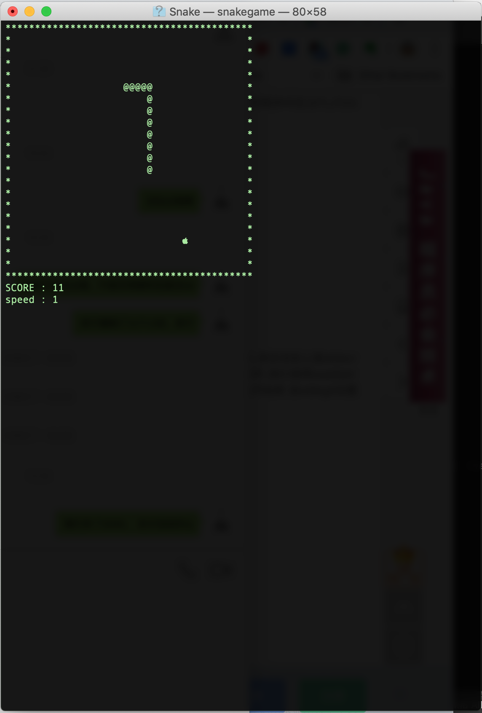

To avoid distraction, I just use the `ncurses.h` to draw the play board in terminal for this game, without SMFL, openGL.  
My goal is to implement the tiny game by using `OOP` and understand the game logica.  


    

## To do further  
Creating a `AI` snake to head to the fruit automatically.   

## Game Logic  
infinite loop till game over!
In each loop, it includes:
1. draw the board  
2. listen to user's keypad input  
3. calculate and update  
4. time delay   

```c
    while(!sg.isOver())
    {
        sg.draw();
        sg.input();
        sg.logic();
        sg.delay();
    }
```

## OO Design and Data Structure

This tiny game is not complex, so I don't need many seperate objects.   

* SnakeGame  
Control the whole game's flow. 

* hash_set  
Record the snake body points for drawing the body and checking if the snake hits itself. 
* deque  
Record the snake body's sequence to push the next "head" and pop the tail if not eating one fruit.   

> I use customized hash function for the STL `unordered_set`.  

## Draw Board Flow
1. initialize and create window  
2. draw with coordinates in the window  
3. deallocation and return   

```c
// this is from internet, noted in <Source>  
int main(int argc, char *argv[]) {
 
    WINDOW *snakeys_world; // create window

    int offsetx, offsety;
 
    initscr();  // initialize, setting and refresh
    refresh();
 
    offsetx = (COLS - WORLD_WIDTH) / 2;
    offsety = (LINES - WORLD_HEIGHT) / 2;
 
    snakeys_world = newwin(WORLD_HEIGHT,
                           WORLD_WIDTH,
                           offsety,
                           offsetx);
 
    box(snakeys_world, 0 , 0);  // draw boarder 
 
    wrefresh(snakeys_world);  // refresh child window(in terminal window)
 
    /*  pause program execution until some keyboard input is received. 
    Thus a key press exits the program. */
    getch(); // wait for input
 

    /* handles memory deallocation and 
    returns the terminal to it’s former state.*/
    delwin(snakeys_world); // destroy window 
    endwin(); // end the curse mode 
 
    return 0; 
}
```

## Functions used <ncurses.h>

* noecho() subverts the terminal from printing back the users key presses. 
This is useful, since otherwise we would quickly have a lot of garbage on-screen from using the arrow keys to guide Snakey.

* cbreak() disables line buffering and feeds input directly to the program.  
If this wasn’t called, character input would be delayed until a newline was entered. Since we would like immediate response from Snakey, this is needed.

* timeout() sets an input delay, in milliseconds, for stdscr, which is applied  
during input with getch() and sibling functions. 
If the user doesn’t input anything within this given time period, getch() returns   
with value ERR. Useful in this part of the code, where we would like Snakey  
to move, even when we are not pressing any keys.  

* The cbreak() routine disables line buffering and erase/kill character-processing (interrupt and flow control characters are unaffected), making characters typed   
by the user immediately available to the program.  

* keypad(win, bool)  
external variable stdscr specifies the default window used by functions  

* halfdelay(int)  
half-delay mode, after blocking for tenths tenths of seconds, ERR is returned   
if nothing has been typed. The value of tenths() must be a number between 1 and 255.  

* refresh() and wrefresh()  
the windows in ncurses are buffered, in the sense that you can do multiple drawing operations on a window, before making them show up on screen. To display the   
contents of a window in the actual terminal, the window needs to be refreshed.  


## Source  

[NCURSES Programming HOWTO](http://tldp.org/HOWTO/NCURSES-Programming-HOWTO/index.html)  
[ncurses man page](https://invisible-island.net/ncurses/man/ncurses.3x.html)
[Ncurses Programming Guide](http://hughm.cs.ukzn.ac.za/~murrellh/os/notes/ncurses.html)
[study openGL](http://www.opengl-tutorial.org/cn/beginners-tutorials/tutorial-1-opening-a-window/#在mac上生成)  
[Adventure Game by using ncurses](https://linux.cn/article-9383-1.html)   

[XCode linker error](https://blog.csdn.net/liujia216/article/details/53112709)  
[when we need to tell compiler to -lxxxlib](https://www.linuxquestions.org/questions/programming-9/several-undefined-reference-to-error-when-compiling-a-c-programm-186781/ )  
ex.   `-lm` 


## Code Examples   
https://gist.github.com/poseidon4o/f2da3d30af9abf84f56e  
https://gitee.com/lt123345/snakegame/tree/master   
https://www.youtube.com/watch?v=MEjaEBv3rQ0   
https://rhardih.io/2010/04/using-ncurses-in-c-for-text-user-interfaces-featuring-xcode/  
